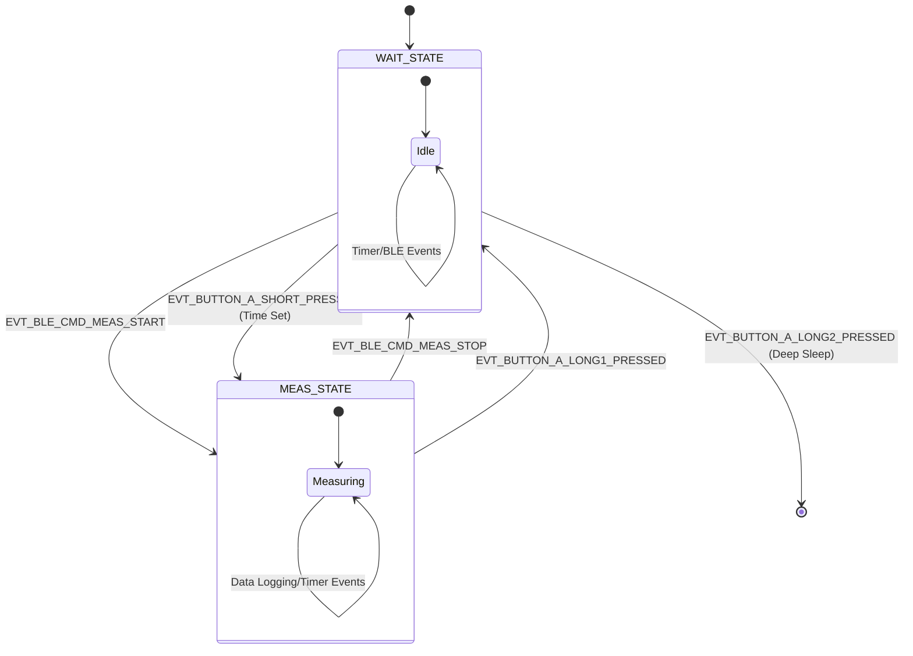
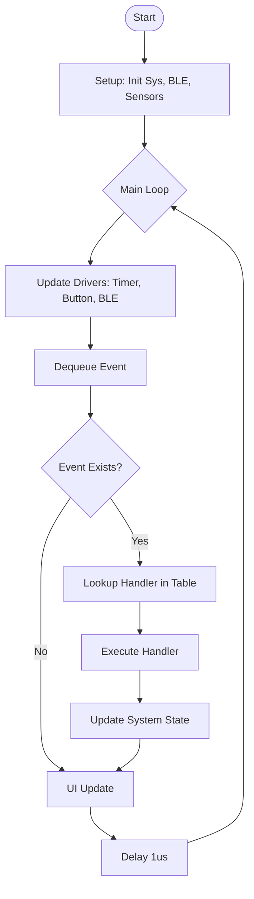

# 状態

- アドバタイズ状態（時刻未設定状態）
- 待機状態
- 時刻設定状態
- データ読み出し状態
- 測定状態
- 測定終了

# BLEコマンド仕様
- 機器情報取得
- 時刻設定
- 時刻取得
- データ読み出し
- 測定開始
- 測定終了

# 保存データ仕様

## サンプリング間隔

加速度計→10Hzで5秒ごとに積算を取る
温湿度センサー→0.2Hz

## データ形式

//タイムスタンプ（4byte）, x 軸加速度積算値（4byte）, y 軸加速度積算値（4byte）, z 軸加速度積算値（4byte）, 温度（2byte）, 湿度（2byte）
//を 5 秒間隔で保存
//5秒あたり20byte。1 分で 240byte。1 時間で 14.4KB。12 時間で 172.8KB。
//5日は保存したいので、1日（MAX12時間）x5=864KB分は確保したい。
タイムスタンプ（4byte）, 加速度積算値1（2byte）, 加速度積算値2（2byte）, 加速度積算値3（2byte）, 加速度積算値4（2byte）, 加速度積算値5（2byte）, 加速度積算値6（2byte）, 加速度積算値7（2byte）, 加速度積算値8（2byte）, 加速度積算値9（2byte）, 加速度積算値10（2byte）, 対象温度（2byte）, 周囲温度（2byte）
を 5 秒間隔で保存
5秒あたり28byte。1 分で 336byte。1 時間で 20.160KB。12 時間で 241.92KB。
5日は保存したいので、1日（MAX12時間）x5=1,209.6KB分は確保したい。

## Flashに書き込むデータ構造
→これ、本当は柔軟にしたかったが、eraseのときの長さが4kB＝（4096）単位なのでそれに合わせる。
→あと、処理がめんどくさいので、機器情報とタイムスタンプ情報は分ける。

Byteごと
0000000 - 0004095 機器メジャーバージョン情報、機器マイナーバージョン情報、機器パッチバージョン情報、あとは予備
0004096 - 0008191 時刻タイムスタンプ
0008192 - 0012287 予備（4096byte）
以降 データ1ページ（262,144(=3 * 1024 * 64)byte分）
以降 データ2ページ（262,144(=3 * 1024 * 64)byte分）
以降 データ3ページ（262,144(=3 * 1024 * 64)byte分）
以降 データ4ページ（262,144(=3 * 1024 * 64)byte分）
以降 データ5ページ（262,144(=3 * 1024 * 64)byte分）

//0000000 - 0004095 機器メジャーバージョン情報、機器マイナーバージョン情報、機器パッチバージョン情報、あとは予備
//0004096 - 0008191 時刻タイムスタンプ
//0008192 - 0012287 予備（4096byte）
//0012288 - 0208895 データ1ページ（196,608(=3 * 1024 * 64)byte分）
//0208896 - 0405503 データ2ページ（196,608(=3 * 1024 * 64)byte分）
//0405504 - 0602111 データ3ページ（196,608(=3 * 1024 * 64)byte分）
//0602112 - 0798719 データ4ページ（196,608(=3 * 1024 * 64)byte分）
//0798720 - 0995327 データ5ページ（196,608(=3 * 1024 * 64)byte分）

# ソフトウェア設計 (Software Design)

## 状態遷移図 (State Transition Diagram)

## フローチャート (Flowchart)

